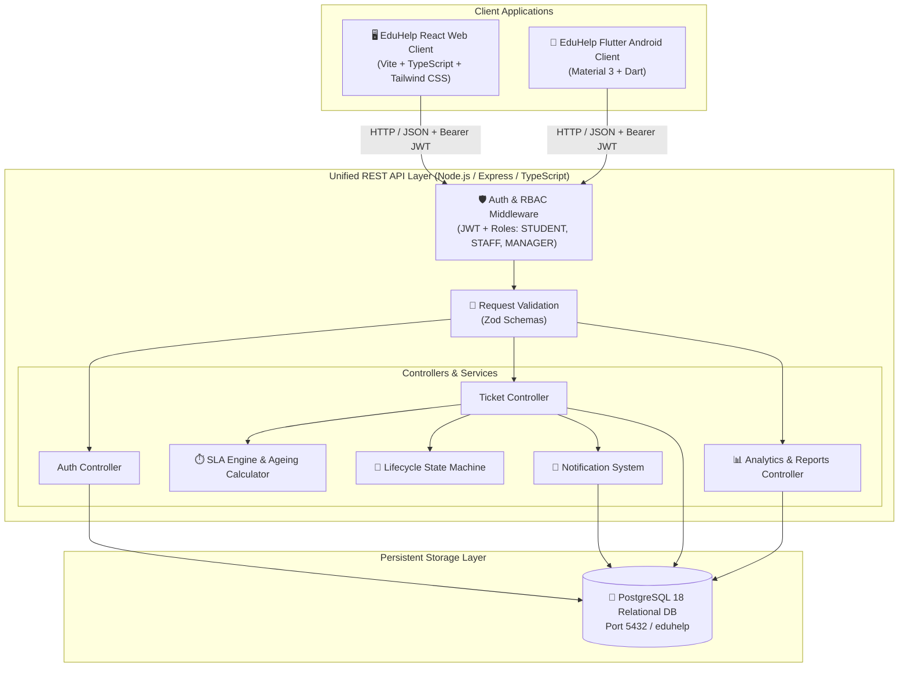
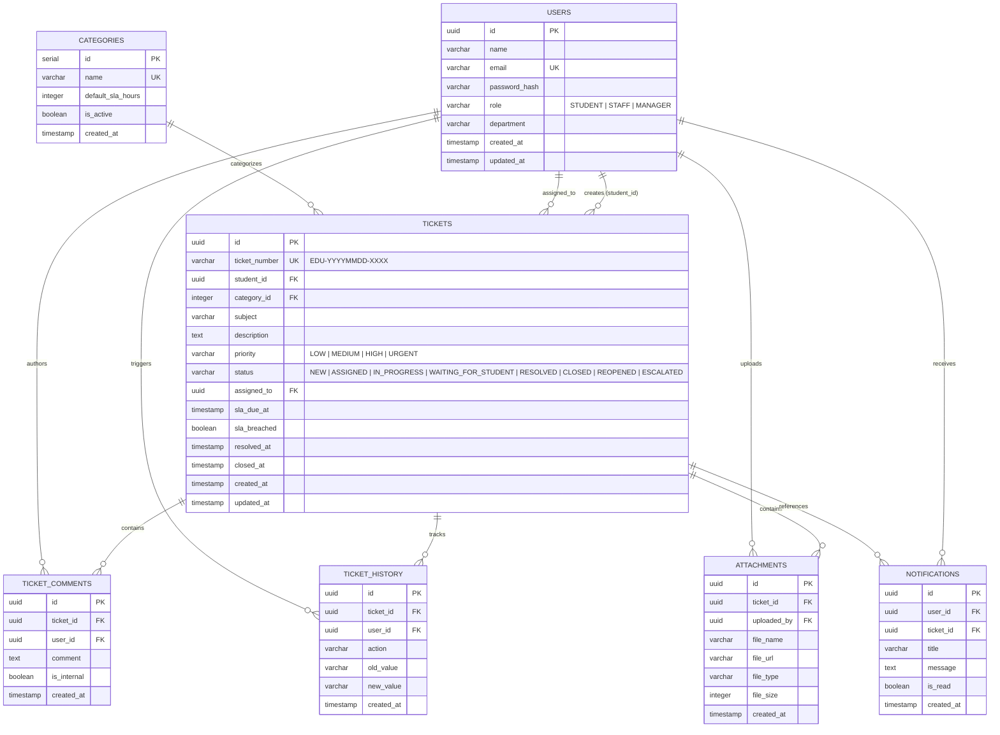
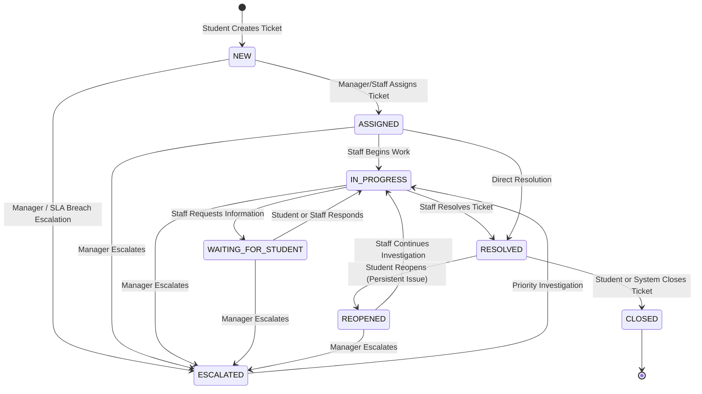

# EduHelp — System Architecture & Technical Specifications

> **Product**: EduHelp Institutional Student Support & Ticket Management SaaS  
> **Prepared for**: Edumerge Solutions Technical / Product Engineering Assessment  
> **Author**: Senior Product & Full-Stack Engineer  
> **Date**: September 24, 2026  
> **Status**: Production-Quality MVP  

---

## 1. High-Level System Architecture

EduHelp is designed with a **unified backend architecture**: a single Node.js/Express REST API backed by a relational PostgreSQL database serves both the primary React Web Application and the companion Flutter Android Mobile Application. Business rules, SLA calculations, role authorization, and state transitions are strictly centralized in the backend.

---

## 2. Component Architecture Breakdown

### 2.1 Web Frontend Architecture (`frontend/`)
- **Framework**: React 18 with Vite 6 & TypeScript in strict mode.
- **Design System & Styling**: Custom tokenized design system using Tailwind CSS with CSS variables (`--primary`, `--background`, `--card`, `--foreground`, `--border`, etc.) supporting instant Dark/Light mode switching.
- **Iconography**: Curated, unified `lucide-react` icons.
- **State & Context Management**:
  - `AuthContext`: Centralized JWT authentication, session storage, proactive role checks, and user profile state.
  - `ThemeContext`: Persisted dark/light theme switching via `localStorage` with system preference fallback.
- **Routing**: `react-router-dom` v6 with role-guarded route boundaries (`ProtectedRoute` for Student, Staff, and Manager layouts).
- **Data Visualization**: `recharts` for operational analytics (Ticket Volume trends, SLA Performance breakdowns, Category distributions, and Ageing histograms).
- **API Communication**: Dedicated Axios client (`frontend/src/services/api.ts`) with request interceptors for automatic Bearer JWT injection and 401 response auto-logout.

### 2.2 Backend Architecture (`backend/`)
- **Runtime**: Node.js v24 LTS + Express.js 4 + TypeScript 5.8 (executed with `tsx`).
- **Data Layer**: Native parameterized queries with `pg` Connection Pool connecting to PostgreSQL 18.
- **Security & Authorization**:
  - `bcrypt` for one-way salted password hashing (work factor 10).
  - Signed JSON Web Tokens (`jsonwebtoken`) containing user ID, email, role, and department.
  - Role-Based Access Control (RBAC) middleware (`requireRole('STUDENT')`, `requireRole('STAFF')`, `requireRole('MANAGER')`).
  - **Internal Notes Seclusion**: Hardcoded SQL filter ensuring `is_internal = false` whenever the requesting user has the `STUDENT` role.
- **Data Validation**: Strict runtime input validation using `Zod` schemas before hitting controllers.
- **Automated Testing**: Comprehensive integration and unit test suite written with `vitest` covering auth, RBAC, lifecycle state transitions, SLA calculations, and edge cases.

### 2.3 Mobile Companion Architecture (`mobile/`)
- **Framework**: Flutter 3.35.6 / Dart 3.9.2.
- **Design System**: Material 3 styled with EduHelp's deep navy brand palette (`#0F172A`, `#2563EB`, `#10B981`, `#F59E0B`, `#E11D48`).
- **Core Functionality**: Focused student companion client for raising requests, tracking ticket progress, live SLA countdown badges, posting comments, and reviewing notifications.
- **API Interoperability**: Direct consumption of the exact same `/api/auth` and `/api/tickets` REST endpoints as the Web client.

---

## 3. Database Entity-Relationship (ER) Design

EduHelp implements a fully normalized 3NF PostgreSQL schema with foreign keys, cascading constraints, and targeted performance indexes.

### 3.1 Performance Indexes
- `idx_tickets_student_id`: Fast lookup for student dashboard queries (`GET /api/tickets/my`).
- `idx_tickets_assigned_to`: Fast filtering for support staff workloads (`GET /api/tickets/assigned`).
- `idx_tickets_status`: Accelerates ticket queues and status grouping.
- `idx_tickets_priority`: Enables priority-based query optimizations.
- `idx_tickets_created_at`: Supports fast temporal range queries and dashboard volume aggregations.
- `idx_tickets_sla_due_at`: Accelerates SLA breach detection and at-risk queries.
- `idx_comments_ticket_id`: Fast retrieval of conversation threads.
- `idx_history_ticket_id`: Efficient timeline reconstructions.

---

## 4. Ticket Lifecycle State Machine

Arbitrary status transitions are strictly forbidden. Transitions are validated by the centralized `LifecycleService` in `backend/src/services/lifecycle.service.ts`.

### 4.1 Transition Rules Table
| Current Status | Permitted Target Statuses | Initiating Role | Business Trigger / Rule |
| :--- | :--- | :--- | :--- |
| `NEW` | `ASSIGNED`, `ESCALATED` | Manager / Staff | Assignment to designated department staff or escalation |
| `ASSIGNED` | `IN_PROGRESS`, `RESOLVED`, `ESCALATED` | Staff / Manager | Support staff begins work or resolves directly |
| `IN_PROGRESS` | `WAITING_FOR_STUDENT`, `RESOLVED`, `ESCALATED` | Staff / Manager | Awaiting student verification or issue resolved |
| `WAITING_FOR_STUDENT` | `IN_PROGRESS`, `RESOLVED`, `ESCALATED` | Student / Staff | Student supplies requested information; automatically moves to `IN_PROGRESS` |
| `RESOLVED` | `CLOSED`, `REOPENED` | Student / Manager | Student confirms resolution or reopens within 7 days |
| `REOPENED` | `IN_PROGRESS`, `ESCALATED` | Staff / Manager | Re-opened investigation begins |
| `ESCALATED` | `IN_PROGRESS` | Staff / Manager | High-priority investigation resumed |
| `CLOSED` | *Terminal State* | — | Cannot be modified further |

---

## 5. SLA Engine & Ageing Specifications

The EduHelp SLA system is fully deterministic, server-enforced, and computed at creation time.

### 5.1 SLA Targets
| Priority | Target SLA Window | SLA Calculation Formula |
| :--- | :--- | :--- |
| **URGENT** | **8 Hours** | `created_at + INTERVAL '8 hours'` |
| **HIGH** | **24 Hours** | `created_at + INTERVAL '24 hours'` |
| **MEDIUM** | **48 Hours** | `created_at + INTERVAL '48 hours'` |
| **LOW** | **72 Hours** | `created_at + INTERVAL '72 hours'` |

### 5.2 SLA Status States
1. **On Track**: Time remaining is $\ge 20\%$ of the initial SLA duration.
2. **At Risk**: Ticket is open and time remaining is $< 20\%$ of total SLA window.
3. **Breached**: Current timestamp exceeds `sla_due_at` and ticket is not in a terminal state (`RESOLVED` or `CLOSED`).

### 5.3 Ageing Brackets
Tickets are classified dynamically into institutional ageing brackets:
- `0–1 day`: Fresh requests actively queued.
- `1–3 days`: In-flight requests within normal operating parameters.
- `3–7 days`: Aged requests requiring operational attention.
- `7+ days`: Stale / severely overdue requests flagged for management intervention.

---

## 6. Security & Data Protection Architecture

1. **Password Hashing**: Uses `bcrypt` with work factor 10. Passwords are never stored in plaintext and never returned in API payloads (`SELECT id, name, email, role, department...`).
2. **Token Security**: 7-day signed JWT tokens signed with a dedicated `JWT_SECRET`.
3. **Internal Notes Seclusion**:
   - Backend controller enforces `WHERE (is_internal = false OR $userRole != 'STUDENT')`.
   - Students cannot view internal notes even if crafting arbitrary API queries.
   - Only `STAFF` and `MANAGER` roles are authorized to create internal notes (`POST /api/tickets/:id/internal-notes`).
4. **Parameterized SQL Queries**: All database operations use `pg` parameter placeholders (`$1, $2, ...`) eliminating SQL injection risks.
5. **No Secrets in Version Control**: All configuration loaded via `.env` with a complete `.env.example` template provided.
